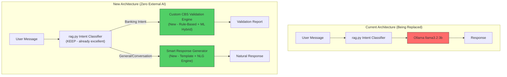

# Custom AI Validation Model for E-Sahakara CBS

Replace Ollama (llama3.2:3b) entirely with a **self-built, zero-dependency AI validation engine** that runs on CPU, requires no external AI services, and is specifically trained on your CBS banking data patterns.

## Architecture Overview



## What Changes

| Component | Current | New |
|-----------|---------|-----|
| Intent Detection | `rag.py` (rule-based) | **KEEP AS-IS** — already works great |
| General Conversation | Ollama `llama3.2:3b` | Smart template NLG engine (no AI needed) |
| PAN/Aadhaar Validation | Regex only | Regex + cross-field ML anomaly detection |
| Phone Validation | Basic regex | Regex + carrier pattern detection |
| Full CBS Validation | Basic field checks | **Full CBS validator** with 15+ checks |
| Conversation Fallback | Ollama HTTP call | Local response generator (0ms latency) |

> [!IMPORTANT]
> **Zero external dependencies**: No Ollama, no OpenAI, no Hugging Face API calls. Everything runs locally on CPU. The ML components use `scikit-learn` (already in your `requirements.txt`).

---

## Proposed Changes

### Component 1: CBS Validation Engine (Core Custom AI)

This is the heart of the system — a hybrid rule-based + ML validation engine purpose-built for cooperative banking.

#### [NEW] [cbs_validator.py](file:///c:/Users/darsh/OneDrive/Desktop/eshakaar/ai-agent/backend/ai_model/cbs_validator.py)

The main validation orchestrator. Runs **15+ validation checks** across all CBS entities:

**Customer Validations:**
1. ✅ PAN format (`[A-Z]{5}[0-9]{4}[A-Z]`) + 4th character type validation (P=Person, C=Company, etc.)
2. ✅ Aadhaar format (12-digit, Verhoeff checksum on last digit when unmasked)
3. ✅ Phone (Indian 10-digit, starts with 6-9, carrier prefix classification)
4. ✅ Name validation (no digits, minimum 2 chars, proper name patterns)
5. ✅ Gender validation (M/F/Other, consistency with salutation if present)
6. ✅ Address completeness (minimum length, PIN code detection)
7. ✅ Duplicate detection (Aadhaar, PAN, Phone across all customers)
8. ✅ Status validation (ACTIVE/PENDING/REJECTED/BLOCKED state machine)
9. ✅ Age/DOB validation (if date_of_birth exists — must be 18+ for accounts)
10. ✅ KYC completeness score (PAN + Aadhaar + Photo + Address proof)

**FD/RD/Share Validations:**
11. ✅ FD: Amount range, maturity date > opening date, interest rate within RBI bounds
12. ✅ RD: Monthly installment consistency, tenure validation
13. ✅ Share: Share value validation, member eligibility
14. ✅ Cross-entity: Customer must exist and be ACTIVE before opening accounts
15. ✅ IFSC code format validation (if applicable)

**Transaction Validations:**
16. ✅ Amount > 0, within daily/transaction limits
17. ✅ Transaction type consistency (CREDIT/DEBIT)
18. ✅ Date sanity (not future-dated unless scheduled)

---

#### [NEW] [anomaly_detector.py](file:///c:/Users/darsh/OneDrive/Desktop/eshakaar/ai-agent/backend/ai_model/anomaly_detector.py)

A lightweight ML-based anomaly detector using `scikit-learn` (already in your requirements). This is the "AI" part that goes beyond simple rules:

- **Trains on your actual CBS database** patterns automatically
- Uses Isolation Forest + statistical analysis
- Detects: unusual transaction amounts, suspicious duplicate patterns, outlier customer data
- **Self-training**: Learns from your MySQL data on startup, no manual training needed
- CPU-only, sub-millisecond inference

```python
# Example: Auto-learns what "normal" looks like in your data
detector = AnomalyDetector()
detector.fit_from_database()  # Reads your MySQL data
score = detector.score_customer(customer_data)  # Returns 0.0-1.0 risk score
```

---

#### [NEW] [field_validators.py](file:///c:/Users/darsh/OneDrive/Desktop/eshakaar/ai-agent/backend/ai_model/field_validators.py)

Enhanced field-level validators that are much smarter than simple regex:

- **PAN**: Format + 4th char type validation + check digit pattern
- **Aadhaar**: Format + Verhoeff algorithm (the actual checksum used by UIDAI)
- **Phone**: Format + carrier detection (Jio/Airtel/Vi/BSNL prefix ranges)
- **IFSC**: Format + first 4 chars = bank code validation
- **Name**: No numbers, proper capitalization, minimum/maximum length
- **Address**: PIN code extraction + state matching
- **Date**: Sanity checks (not future birth dates, age >= 18, etc.)
- **Account Number**: Format validation for CBS account numbering scheme

---

#### [NEW] [confidence_scorer.py](file:///c:/Users/darsh/OneDrive/Desktop/eshakaar/ai-agent/backend/ai_model/confidence_scorer.py)

Produces an overall **confidence score (0-100%)** and a risk level (LOW/MEDIUM/HIGH/CRITICAL) for each validation:

```
Customer 5 Validation Report:
━━━━━━━━━━━━━━━━━━━━━━━━━━━━
Overall Confidence: 87%  [■■■■■■■■■□]
Risk Level: LOW

✅ PAN: VALID (ABCDE1234F — Individual type)
✅ Aadhaar: VALID FORMAT (12 digits, checksum passed)
✅ Phone: VALID (9876543210 — Jio carrier range)
⚠️ Address: PARTIAL (Missing PIN code)
✅ Status: ACTIVE
✅ No duplicates found

Recommendations:
• Request PIN code for residential address
```

---

### Component 2: Smart Response Generator (Replaces Ollama for Conversation)

#### [NEW] [response_engine.py](file:///c:/Users/darsh/OneDrive/Desktop/eshakaar/ai-agent/backend/ai_model/response_engine.py)

Replaces `ollama_client.py` for ALL conversation scenarios. Uses template-based NLG (Natural Language Generation) with context-awareness:

- **Greeting responses**: Time-of-day aware (already exists in `agent.py`, will be enhanced)
- **Validation result formatting**: Converts raw validation results into human-readable, friendly explanations
- **Error explanations**: Explains WHY a field is invalid and HOW to fix it
- **Contextual follow-ups**: "The PAN for customer 5 is invalid because it has only 9 characters instead of the required 10"
- **Help/capability responses**: Explains what the system can do
- **Unknown query handling**: Graceful "I can help with..." instead of Ollama timeout errors

> [!TIP]
> This removes the biggest pain points with Ollama: **timeout errors**, **GPU requirement**, **model download**, and **inconsistent responses**. The template engine responds in <1ms.

---

### Component 3: Integration Changes

#### [MODIFY] [agent.py](file:///c:/Users/darsh/OneDrive/Desktop/eshakaar/ai-agent/backend/agent/agent.py)

- Replace `from agent.ollama_client import chat_general` → `from ai_model.response_engine import generate_response`
- Update `handle_validation()` to use the new `cbs_validator` instead of inline regex
- Route general conversation to `response_engine` instead of Ollama
- Add new validation intents: `FULL_CBS_VALIDATION`, `TRANSACTION_VALIDATION`, `ACCOUNT_VALIDATION`

#### [MODIFY] [main.py](file:///c:/Users/darsh/OneDrive/Desktop/eshakaar/ai-agent/backend/main.py)

- Remove Ollama URL/model/timeout configuration
- Add model initialization on startup (auto-train anomaly detector)
- Add new API endpoint: `POST /api/validate` for direct validation calls
- Update `/api/chat` to use the new engine

#### [MODIFY] [config.py](file:///c:/Users/darsh/OneDrive/Desktop/eshakaar/ai-agent/backend/config.py)

- Remove `OLLAMA_URL`, `OLLAMA_MODEL`, `OLLAMA_TIMEOUT`
- Add validation thresholds configuration
- Add anomaly detection sensitivity settings

#### [MODIFY] [.env](file:///c:/Users/darsh/OneDrive/Desktop/eshakaar/ai-agent/backend/.env)

- Remove `OLLAMA_URL` and `OLLAMA_MODEL`
- Add `VALIDATION_CONFIDENCE_THRESHOLD=70` and `ANOMALY_SENSITIVITY=medium`

#### [DELETE] [ollama_client.py](file:///c:/Users/darsh/OneDrive/Desktop/eshakaar/ai-agent/backend/agent/ollama_client.py)

No longer needed — fully replaced by `response_engine.py`.

#### [MODIFY] [requirements.txt](file:///c:/Users/darsh/OneDrive/Desktop/eshakaar/ai-agent/backend/requirements.txt)

- Remove `httpx` (was only used for Ollama HTTP calls)
- Add `numpy` (for anomaly detection math)
- Keep `scikit-learn` (already present)

---

### Component 4: Enhanced Question Bank

#### [MODIFY] [question_bank.py](file:///c:/Users/darsh/OneDrive/Desktop/eshakaar/ai-agent/backend/question_bank.py)

Add new intents for the expanded validation capabilities:
- `FULL_CBS_VALIDATION` — "run full validation on customer 5"
- `TRANSACTION_VALIDATION` — "validate transaction data"
- `ACCOUNT_VALIDATION` — "validate FD account of customer 3"
- `RISK_ASSESSMENT` — "what is the risk score for customer 5"

#### [MODIFY] [rag.py](file:///c:/Users/darsh/OneDrive/Desktop/eshakaar/ai-agent/backend/rag.py)

Add detection for the new validation intents in `retrieve_intent()`.

---

## New File Structure

```
ai-agent/backend/
├── ai_model/                     ← NEW: Your custom AI model package
│   ├── __init__.py
│   ├── cbs_validator.py          ← Main validation orchestrator
│   ├── field_validators.py       ← Enhanced field-level validators
│   ├── anomaly_detector.py       ← ML-based anomaly detection (scikit-learn)
│   ├── confidence_scorer.py      ← Confidence scoring engine
│   └── response_engine.py        ← Replaces Ollama for conversation
├── agent/
│   ├── agent.py                  ← MODIFIED: Uses new ai_model
│   ├── database_agent.py         ← UNCHANGED
│   ├── response.py               ← UNCHANGED
│   └── ollama_client.py          ← DELETED
├── validators/
│   └── customer_validation.py    ← KEPT (backward compat), but new code uses ai_model
├── main.py                       ← MODIFIED: New endpoints, no Ollama
├── rag.py                        ← MODIFIED: New intents
├── config.py                     ← MODIFIED: No Ollama config
└── requirements.txt              ← MODIFIED: numpy added, httpx removed
```

---

## Open Questions — Resolved ✅

> [!TIP]
> **Q1: CBS Account Number Format** — ✅ **Resolved**: Account number formats are defined in the **Scheme Master** tables within master settings. The validation engine will dynamically read these formats from the database — no hardcoding needed.

> [!TIP]
> **Q2: Transaction Limits** — ✅ **Resolved**: Transaction limits are also defined in the **Master Settings / Scheme Master** tables. The engine will query these limits at runtime for validation.

> [!TIP]
> **Q3: Training Data** — ✅ **Resolved**: The anomaly detector will auto-read and train from the MySQL database (customer, transaction, scheme master tables) on server startup. It will learn the actual data patterns from the existing CBS data.

---

## Verification Plan

### Automated Tests
```bash
# Run the validation engine tests
python -m pytest tests/test_cbs_validator.py -v

# Test field validators independently
python -m pytest tests/test_field_validators.py -v

# Verify anomaly detector training
python -m pytest tests/test_anomaly_detector.py -v

# Integration test: full chat flow without Ollama
python -m pytest tests/test_no_ollama.py -v
```

### Manual Verification
1. Start the server with `uvicorn main:app --reload` — verify NO Ollama errors
2. Chat: "hi" → should get greeting (no Ollama call)
3. Chat: "validate customer 1" → should get full CBS validation report
4. Chat: "what is the risk score for customer 3" → should get anomaly score
5. Chat: "check PAN and Aadhaar of all users" → bulk validation
6. Verify the AI chatbot UI still works without any Ollama dependency
